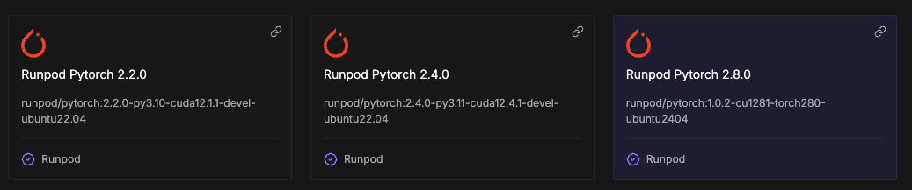
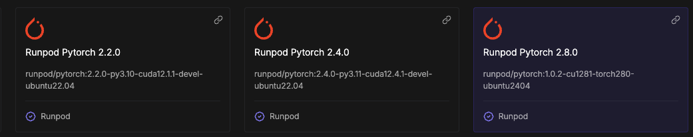

# แผนการเปรียบเทียบ Performance บน GPU หลายตัว

## 📋 ภาพรวม

แผนการเปรียบเทียบ Performance ของ Transcription Service บน GPU 3 ตัว:
- **RTX 4080 Super** (ปัจจุบัน - Baseline)
- **RTX 4000 Ada** (Server 1)
- **RTX 5080 (16 GB VRAM)** (Server 2)

## 🎯 วัตถุประสงค์

1. เปรียบเทียบ Performance (Speed, Throughput, Latency)
2. ตรวจสอบความเข้ากันได้ของ Scripts และ Requirements
3. วิเคราะห์ Resource Utilization (VRAM, GPU Usage)
4. หา Optimal Configuration สำหรับแต่ละ GPU

## 🔧 สภาพแวดล้อมปัจจุบัน

### Base Image
```
runpod/pytorch:2.1.0-py3.10-cuda11.8.0-devel-ubuntu22.04
```

### Software Stack
- **PyTorch**: 2.1.0 / 2.1.1 (CUDA 11.8)
- **CUDA**: 11.8
- **Python**: 3.10
- **faster-whisper**: 1.0.2
- **ctranslate2**: 4.5.0
- **numpy**: 1.26.4

## ✅ ความเข้ากันได้ของ GPU

### CUDA Compute Capability

| GPU | Compute Capability | CUDA 11.8 Support | CUDA 12.x Support | Recommended Base Image |
|-----|-------------------|-------------------|-------------------|----------------------|
| RTX 4080 Super | 8.9 (Ada Lovelace) | ✅ Yes | ✅ Yes | `runpod/pytorch:2.1.0-py3.10-cuda11.8.0-devel-ubuntu22.04` |
| RTX 4000 Ada | 8.9 (Ada Lovelace) | ✅ Yes | ✅ Yes | `runpod/pytorch:2.1.0-py3.10-cuda11.8.0-devel-ubuntu22.04` |
| RTX 5080 | 9.0 (Blackwell) | ⚠️ Limited* | ✅ **Recommended** | `runpod/pytorch:2.4.0-py3.11-cuda12.4.1-devel-ubuntu22.04` หรือ `runpod/pytorch:1.0.2-cu1281-torch280-ubuntu2404` |

\* **หมายเหตุ**: RTX 5080 (Blackwell) มี Compute Capability 9.0 ซึ่งต้องการ CUDA 12.8+ เพื่อประสิทธิภาพเต็มที่

### สรุปความเข้ากันได้

**✅ แนะนำ: ใช้ Base Image ต่างกันตาม GPU**

#### สำหรับ RTX 4080 Super และ RTX 4000 Ada:
- **Base Image**: `runpod/pytorch:2.1.0-py3.10-cuda11.8.0-devel-ubuntu22.04`
- **PyTorch**: 2.1.0/2.1.1 (CUDA 11.8)
- **Python**: 3.10
- **CUDA**: 11.8

#### สำหรับ RTX 5080:
- **Base Image (แนะนำ)**: `runpod/pytorch:2.4.0-py3.11-cuda12.4.1-devel-ubuntu22.04`
  - PyTorch 2.4.0, Python 3.11, CUDA 12.4.1
  - รองรับ Blackwell architecture ได้ดี
- **Base Image (ทางเลือก)**: `runpod/pytorch:1.0.2-cu1281-torch280-ubuntu2404`
  - PyTorch 2.8.0, CUDA 12.8.1, Ubuntu 24.04
  - รองรับ RTX 5080 ได้เต็มที่ แต่ต้องตรวจสอบ compatibility ของ dependencies

**⚠️ ข้อควรระวัง**
- RTX 5080 **ควรใช้ CUDA 12.x** เพื่อประสิทธิภาพเต็มที่
- Driver version ควรเป็น 550.54.15 หรือใหม่กว่า (รองรับ Blackwell)
- faster-whisper และ ctranslate2 รองรับ CUDA 12.x ได้

## 📁 โครงสร้างการจัดระเบียบ

### แนวทางที่แนะนำ: **ใช้ Scripts และ Requirements เดียวกันก่อน**

```
transcription-close-caption-service/
├── scripts/
│   ├── pod/                    # Scripts ปัจจุบัน (ใช้ร่วมกัน)
│   │   ├── install-dependencies.sh
│   │   ├── setup-pod.sh
│   │   ├── start-pod.sh
│   │   └── ...
│   └── benchmark/              # Scripts สำหรับการเปรียบเทียบ (ใหม่)
│       ├── run-benchmark.sh
│       ├── compare-results.sh
│       ├── collect-metrics.sh
│       └── generate-report.sh
├── requirements.txt            # Requirements เดียวกัน (ใช้ร่วมกัน)
├── requirements-gpu-specific/   # (ถ้าจำเป็นในอนาคต)
│   ├── requirements-rtx4000.txt
│   ├── requirements-rtx5080.txt
│   └── requirements-rtx4080.txt
├── configs/                    # Config files สำหรับแต่ละ GPU (ใหม่)
│   ├── gpu-rtx4080.env
│   ├── gpu-rtx4000.env
│   └── gpu-rtx5080.env
└── docs/
    ├── GPU_PERFORMANCE_COMPARISON_PLAN.md (ไฟล์นี้)
    └── GPU_BENCHMARK_RESULTS.md (จะสร้างหลังทดสอบ)
```

## 🚀 แผนการดำเนินงาน

### Phase 1: เบื้องต้น - ใช้ Base Image ตาม GPU

**วัตถุประสงค์**: ตรวจสอบความเข้ากันได้พื้นฐานและประสิทธิภาพ

#### สำหรับ RTX 4080 Super และ RTX 4000 Ada:
1. **Base Image**: `runpod/pytorch:2.1.0-py3.10-cuda11.8.0-devel-ubuntu22.04`
2. **Scripts**: `scripts/pod/*.sh` (ใช้ร่วมกัน)
3. **Requirements**: `requirements.txt` (ปัจจุบัน)
4. **Config**: `.env.runpod` (default settings)

#### สำหรับ RTX 5080:
1. **Base Image**: `runpod/pytorch:2.4.0-py3.11-cuda12.4.1-devel-ubuntu22.04` ⭐
   - หรือ `runpod/pytorch:1.0.2-cu1281-torch280-ubuntu2404` (ถ้าต้องการ CUDA 12.8.1)
2. **Scripts**: `scripts/pod/*.sh` (ปรับแต่งสำหรับ CUDA 12.x)
3. **Requirements**: `requirements.txt` (อาจต้องปรับ PyTorch version)
4. **Config**: `.env.runpod` (อาจต้องปรับ settings)

**หมายเหตุ**: Scripts ส่วนใหญ่ใช้ร่วมกันได้ แต่ต้องปรับ `install-dependencies.sh` สำหรับ CUDA 12.x

### Phase 2: การทดสอบและเก็บ Metrics

1. **รัน Benchmark บนแต่ละ GPU**
   - ใช้ test video เดียวกัน
   - ใช้ Whisper model เดียวกัน (medium หรือ large-v3)
   - เก็บ metrics: เวลา, VRAM usage, GPU utilization

2. **เก็บผลลัพธ์**
   - สร้าง `docs/GPU_BENCHMARK_RESULTS.md`
   - เปรียบเทียบ Performance metrics

### Phase 3: ปรับแต่ง (ถ้าจำเป็น)

ถ้าพบว่าต้องการปรับแต่งสำหรับ GPU เฉพาะ:

1. **สร้าง GPU-specific configs**
   - `configs/gpu-rtx4000.env` (ถ้าต้องการ batch size หรือ settings ต่างกัน)
   - `configs/gpu-rtx5080.env`

2. **ปรับแต่ง Scripts** (ถ้าจำเป็น)
   - เพิ่ม logic สำหรับ detect GPU และใช้ config ที่เหมาะสม

## 📊 Metrics ที่จะเก็บ

### Performance Metrics
- **Transcription Time**: เวลาที่ใช้ในการ transcribe video (วินาที)
- **Throughput**: วิดีโอต่อชั่วโมง (videos/hour)
- **Latency**: เวลาตอบสนอง (response time)

### Resource Metrics
- **VRAM Usage**: การใช้ VRAM (GB)
- **GPU Utilization**: % การใช้งาน GPU
- **Memory Bandwidth**: GB/s
- **Power Consumption**: วัตต์ (ถ้าวัดได้)

### Quality Metrics
- **Accuracy**: ความแม่นยำ (ถ้ามี ground truth)
- **Word Error Rate (WER)**: (ถ้ามี ground truth)

## 🔍 วิธีการเปรียบเทียบ

### Test Cases

1. **Test Case 1: Small Video (1-5 นาที)**
   - Model: `medium`
   - เปรียบเทียบ: Speed, Latency

2. **Test Case 2: Medium Video (10-30 นาที)**
   - Model: `medium`
   - เปรียบเทียบ: Throughput, VRAM usage

3. **Test Case 3: Large Video (30-60 นาที)**
   - Model: `large-v3`
   - เปรียบเทียบ: Performance, Resource utilization

4. **Test Case 4: Batch Processing**
   - หลายวิดีโอพร้อมกัน
   - เปรียบเทียบ: Throughput, Stability

## 📝 สรุปคำแนะนำ

### ✅ แนะนำ: ใช้ Base Image ต่างกันตาม GPU

**สำหรับ RTX 4080 Super และ RTX 4000 Ada:**
- **Base Image**: `runpod/pytorch:2.1.0-py3.10-cuda11.8.0-devel-ubuntu22.04`
- **Scripts**: `scripts/pod/install-dependencies.sh` (CUDA 11.8)
- **เหตุผล**: 
  - รองรับ CUDA 11.8 ได้ดี
  - มีความเสถียรและผ่านการทดสอบแล้ว
  - faster-whisper ทำงานได้ดี

**สำหรับ RTX 5080:**
- **Base Image**: `runpod/pytorch:2.4.0-py3.11-cuda12.4.1-devel-ubuntu22.04` ⭐
- **Scripts**: `scripts/pod/install-dependencies-cuda12.sh` (CUDA 12.x)
- **เหตุผล**:
  - RTX 5080 (Blackwell) ต้องการ CUDA 12.8+ เพื่อประสิทธิภาพเต็มที่
  - CUDA 12.4.1 รองรับ Blackwell architecture ได้ดี
  - PyTorch 2.4.0 รองรับ CUDA 12.x และ GPU ใหม่

**Dockerfile สำหรับ RTX 5080:**
- `Dockerfile.runpod-rtx5080` - Base image สำหรับ RTX 5080

### ⚠️ ข้อควรระวัง

1. **RTX 5080**: อาจได้ประโยชน์จาก CUDA 12.x แต่ยังใช้ CUDA 11.8 ได้
2. **Driver Version**: ตรวจสอบว่า driver รองรับ GPU ทั้งหมด
3. **VRAM Differences**: RTX 4000 Ada อาจมี VRAM น้อยกว่า (ตรวจสอบ spec)
4. **Thermal Throttling**: ตรวจสอบอุณหภูมิ GPU ระหว่างทดสอบ

### 🔄 ขั้นตอนถัดไป

#### สำหรับ RTX 4080 Super และ RTX 4000 Ada

1. **ตั้งค่า Base Image ใน RunPod Template**:
   - Container Image: `runpod/pytorch:2.1.0-py3.10-cuda11.8.0-devel-ubuntu22.04` (ไม่ต้องเปลี่ยน)

2. **Git Pull และ Setup**:
   ```bash
   cd /workspace/transcription-service
   git pull
   bash scripts/pod/install-dependencies.sh
   bash scripts/pod/setup-pod.sh
   bash scripts/pod/start-pod.sh
   ```

#### สำหรับ RTX 5080

1. **ตั้งค่า Base Image ใน RunPod Template**:
   - เปลี่ยน Container Image เป็น: `runpod/pytorch:2.4.0-py3.11-cuda12.4.1-devel-ubuntu22.04`

2. **Git Pull และ Setup**:
   ```bash
   cd /workspace/transcription-service
   git pull
   bash scripts/pod/install-dependencies-cuda12.sh  # ⚠️ ใช้ script สำหรับ CUDA 12.x
   bash scripts/pod/setup-pod.sh
   bash scripts/pod/start-pod.sh
   ```

#### รัน Benchmark

3. **รัน Benchmark บนแต่ละ GPU**:
   ```bash
   # RTX 4080 Super (Baseline)
   bash scripts/benchmark/run-benchmark.sh uploads/test.mp4 medium rtx4080
   
   # RTX 4000 Ada
   bash scripts/benchmark/run-benchmark.sh uploads/test.mp4 medium rtx4000
   
   # RTX 5080
   bash scripts/benchmark/run-benchmark.sh uploads/test.mp4 medium rtx5080
   ```

4. **เปรียบเทียบผลลัพธ์**:
   ```bash
   bash scripts/benchmark/compare-results.sh rtx4080 rtx4000 rtx5080
   ```

5. **ปรับแต่ง (ถ้าจำเป็น)**
   - สร้าง GPU-specific configs
   - ปรับ batch size หรือ settings ตามผลลัพธ์

**หมายเหตุ**: `Dockerfile.runpod-rtx5080` ไม่จำเป็นถ้าใช้ Git pull ตรงๆ แค่เปลี่ยน base image ใน RunPod Template และใช้ `install-dependencies-cuda12.sh` แทน

## 📚 เอกสารอ้างอิง

- [NVIDIA CUDA Compatibility Guide](https://docs.nvidia.com/cuda/cuda-toolkit-release-notes/index.html)
- [PyTorch CUDA Support](https://pytorch.org/get-started/locally/)
- [faster-whisper Documentation](https://github.com/guillaumekln/faster-whisper)

