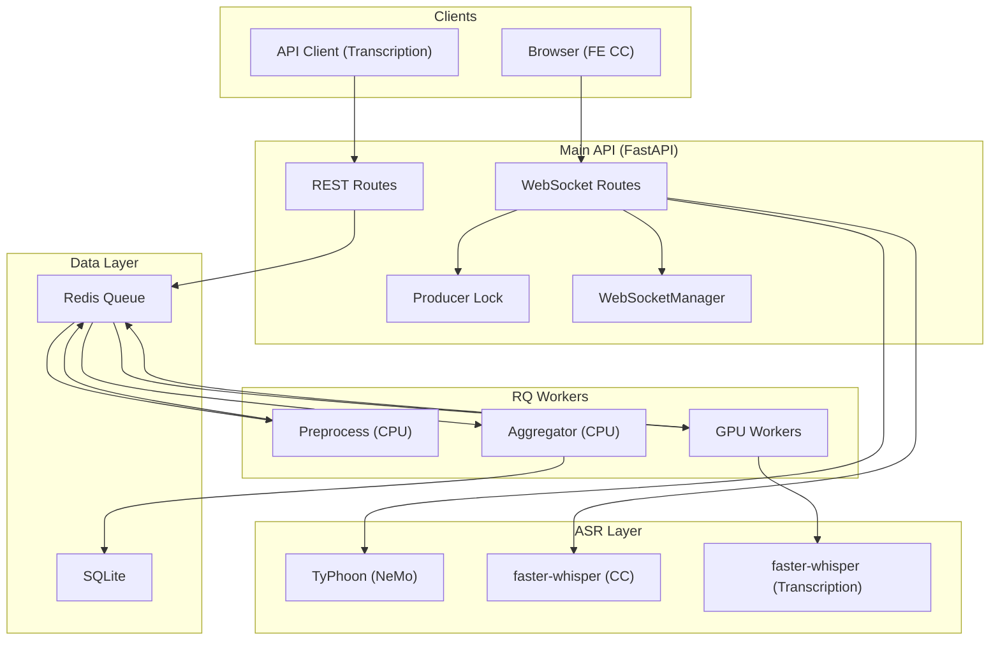
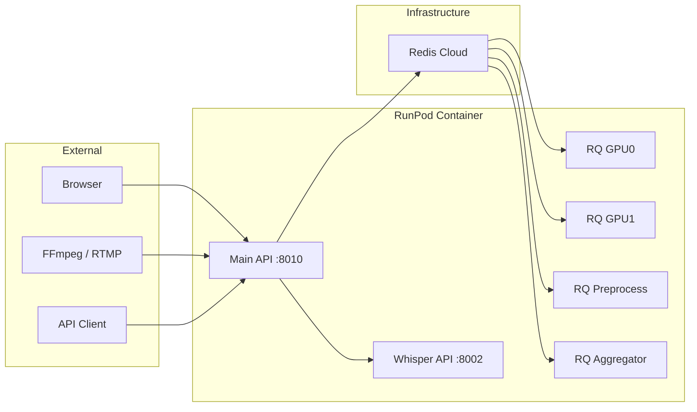

# System Architecture

## ภาพรวม

ระบบ Transcription Service แบ่งเป็น 2 โหมดหลัก: **FE Live Caption** (real-time) และ **Transcription** (file-based) พร้อม Shared ASR Layer และ Data Layer

---

## High-Level Architecture

---

## Component Architecture

### 1. Main API Layer (Port 8010)

| Component | หน้าที่ |
|-----------|---------|
| **WebSocket Routes** | `/api/ws/ingest-audio`, `/api/ws/captions` — รับ PCM, broadcast caption |
| **REST Routes** | `/api/transcribe/`, `/api/v2/tasks/*`, `/api/transcription/realtime/*` |
| **Producer Lock** | จำกัด 1 producer ต่อ meeting_id (in-memory, TTL-based) |
| **WebSocketManager** | จัดการการเชื่อมต่อ WebSocket และ broadcast ตาม meeting_id |

### 2. ASR Layer

| Component | Engine | Use Case |
|-----------|--------|----------|
| **TyPhoon ASR** | NeMo FastConformer-Transducer | FE CC (เมื่อ `FE_CC_PROVIDER=typhoon`) |
| **faster-whisper** | CTranslate2 | FE CC fallback, Transcription หลัก |
| **NeMoTyphoonProvider** | NeMo (file transcription) | เมื่อ `WHISPER_PROVIDER=nemo-typhoon` |

### 3. Worker Layer (RQ + Redis)

| Queue | หน้าที่ |
|-------|---------|
| `transcription_preprocess` | Extract audio, แบ่ง chunks |
| `transcription_gpu0`, `transcription_gpu1`, ... | Transcription chunks (1 GPU ต่อ queue) |
| `transcription_priority` | Live-chunk / realtime chunks (ความสำคัญสูง) |
| `transcription_cpu` | Aggregator — รวม segments เป็น full text |

### 4. Data Layer

| Store | หน้าที่ |
|-------|---------|
| **Redis** | Job queue (RQ), session/cache |
| **SQLite** | transcriptions, segments, captions, video_tasks, live_streams, uploaded_files |

---

## Deployment Architecture

---

## Design Principles

| หลักการ | รายละเอียด |
|---------|-------------|
| **แยก FE CC กับ Transcription** | FE CC รันใน Main API (low latency); Transcription ใช้ RQ Workers |
| **1 GPU = 1 Process** | ไม่สลับ `CUDA_VISIBLE_DEVICES` ใน runtime |
| **Provider Independence** | FE CC: `FE_CC_PROVIDER`; Transcription: `WHISPER_PROVIDER` |
| **Fallback** | TyPhoon ไม่พร้อม → fallback เป็น faster-whisper อัตโนมัติ |
| **Job-based Transcription** | Request → enqueue → worker process → result |
