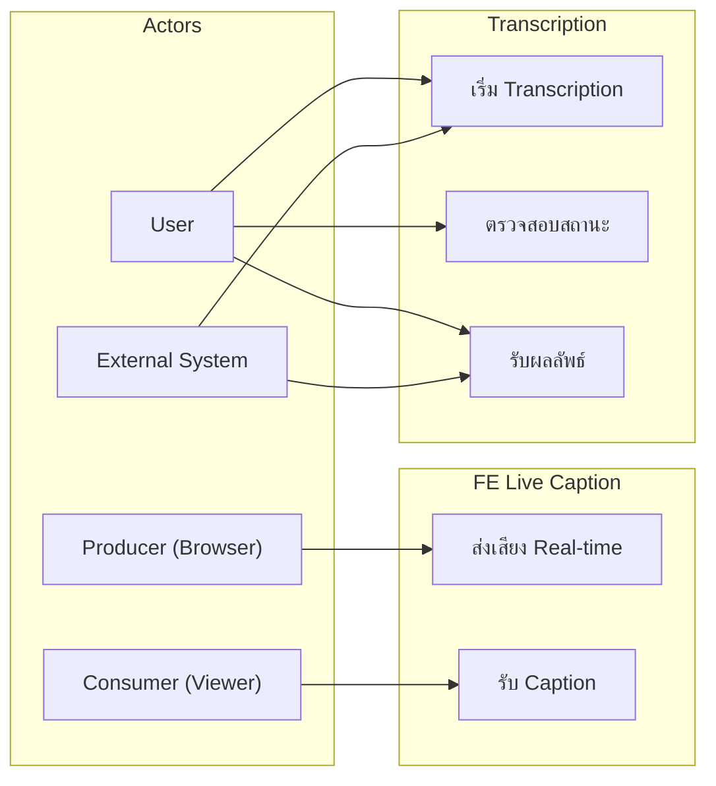
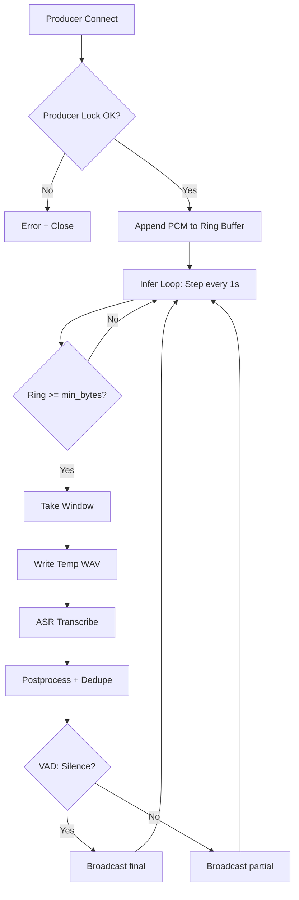
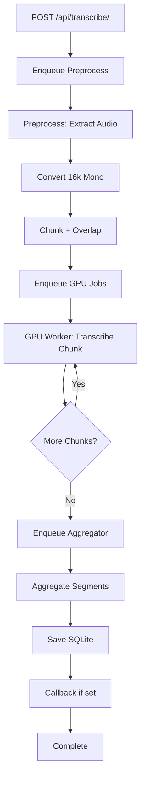
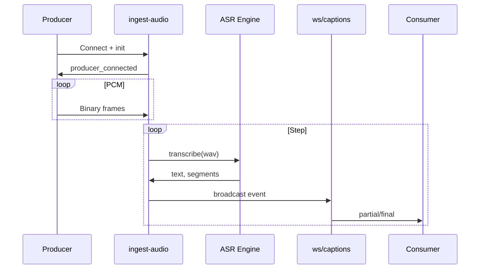
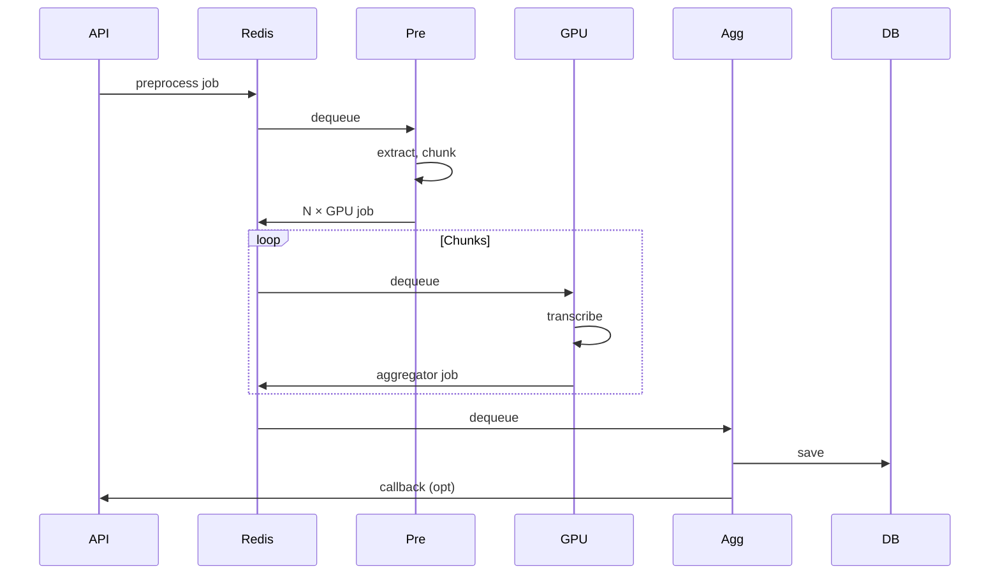

# Use Case, Activity และ Process Flow

## Use Case Diagram

---

## Use Case รายละเอียด

### UC-01: ส่งเสียง Real-time (FE CC Producer)

| รายการ | รายละเอียด |
|--------|-------------|
| **Actor** | Producer (Browser/AudioWorklet) |
| **Precondition** | meeting_id ไม่ถูก lock โดย producer อื่น |
| **Flow หลัก** | 1. Connect WebSocket ingest-audio 2. ส่ง JSON init 3. ส่ง PCM16 binary frames ต่อเนื่อง |
| **Postcondition** | ระบบทำ transcription และ broadcast caption ไปยัง consumers |
| **Alternative** | Producer lock conflict → error + close |

### UC-02: รับ Caption (FE CC Consumer)

| รายการ | รายละเอียด |
|--------|-------------|
| **Actor** | Consumer (Viewer/Frontend) |
| **Precondition** | Connect WebSocket captions ด้วย meeting_id |
| **Flow หลัก** | 1. Connect 2. รับ sync, status 3. รับ partial/final events |
| **Postcondition** | แสดง caption แบบ real-time |

### UC-03: เริ่ม Transcription

| รายการ | รายละเอียด |
|--------|-------------|
| **Actor** | User / External System |
| **Precondition** | มี file_path หรือ file_url ที่เข้าถึงได้ |
| **Flow หลัก** | 1. POST /api/transcribe/ 2. ระบบ enqueue preprocess 3. คืน task_id |
| **Postcondition** | Job ใน queue รอ processing |

### UC-04: ตรวจสอบสถานะ Transcription

| รายการ | รายละเอียด |
|--------|-------------|
| **Actor** | User |
| **Precondition** | มี task_id |
| **Flow หลัก** | GET /api/v2/tasks/{task_id}?format=progress |
| **Postcondition** | ได้ progress, current_stage |

### UC-05: รับผลลัพธ์ Transcription

| รายการ | รายละเอียด |
|--------|-------------|
| **Actor** | User / External System (callback_url) |
| **Precondition** | Task completed |
| **Flow หลัก** | GET /api/v2/tasks/{task_id} หรือรับ callback POST |
| **Postcondition** | ได้ full_text, segments |

---

## Activity Diagrams

### Activity: FE CC End-to-End

### Activity: Transcription Job lifecycle

---

## Process Flow

### FE CC: Sequence Flow

### Transcription: Sequence Flow

