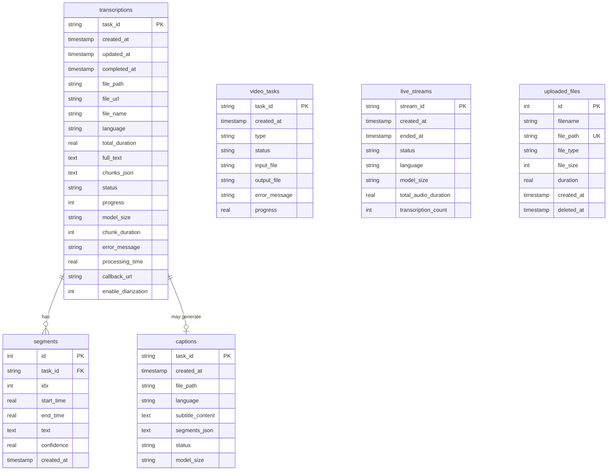
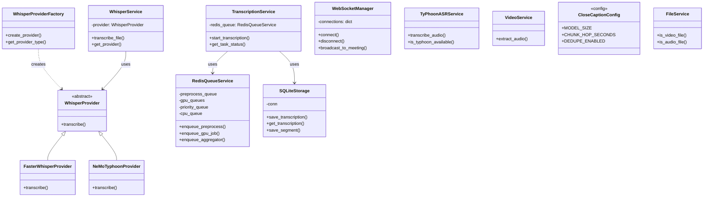

# System Design: ER Diagram, Class Diagram, Data Dictionary

## ER Diagram

---

## Class Diagram

---

## Data Dictionary

### transcriptions

| Column | Type | Nullable | Description |
|--------|------|----------|-------------|
| task_id | TEXT | NO | PK, UUID |
| created_at | TIMESTAMP | YES | เวลาสร้าง |
| updated_at | TIMESTAMP | YES | เวลาอัปเดตล่าสุด |
| completed_at | TIMESTAMP | YES | เวลาเสร็จสิ้น |
| file_path | TEXT | YES | path ไฟล์ในระบบ |
| file_url | TEXT | YES | URL ไฟล์ (ถ้าใช้ URL) |
| file_name | TEXT | YES | ชื่อไฟล์ |
| language | TEXT | YES | ภาษา (th, en, auto) |
| total_duration | REAL | YES | ความยาวเสียง (วินาที) |
| full_text | TEXT | YES | ข้อความเต็ม |
| original_text | TEXT | YES | ข้อความดิบก่อน postprocess |
| corrected_text | TEXT | YES | หลัง Thai processing |
| partial_text | TEXT | YES | ข้อความบางส่วน (streaming) |
| chunks_json | TEXT | YES | JSON ของ chunks |
| status | TEXT | YES | pending, processing, completed, failed |
| progress | INTEGER | YES | 0–100 |
| model_size | TEXT | YES | base, small, medium, large-v3, turbo |
| chunk_duration | INTEGER | YES | วินาทีต่อ chunk |
| error_message | TEXT | YES | ข้อความ error |
| processing_time | REAL | YES | เวลาประมวลผล (วินาที) |
| transcription_time | REAL | YES | เวลา transcription |
| audio_extraction_time | REAL | YES | เวลา extract audio |
| current_stage | TEXT | YES | สถานะขั้นตอนปัจจุบัน |
| current_stage_description | TEXT | YES | คำอธิบาย |
| stage_progress | INTEGER | YES | ความคืบหน้าขั้นตอน |
| job_id | TEXT | YES | RQ job ID |
| callback_url | TEXT | YES | URL สำหรับ callback |
| enable_diarization | INTEGER | YES | 0/1 |

### segments

| Column | Type | Nullable | Description |
|--------|------|----------|-------------|
| id | INTEGER | NO | PK, autoincrement |
| task_id | TEXT | NO | FK → transcriptions |
| idx | INTEGER | NO | ลำดับ segment |
| start_time | REAL | NO | เวลาเริ่ม (วินาที) |
| end_time | REAL | NO | เวลาสิ้นสุด (วินาที) |
| text | TEXT | NO | ข้อความ segment |
| confidence | REAL | YES | ความมั่นใจ (0–1) |
| created_at | TIMESTAMP | YES | เวลาสร้าง |

### captions

| Column | Type | Nullable | Description |
|--------|------|----------|-------------|
| task_id | TEXT | NO | PK |
| created_at | TIMESTAMP | YES | |
| file_path | TEXT | YES | |
| language | TEXT | YES | |
| subtitle_format | TEXT | YES | srt, vtt |
| subtitle_content | TEXT | YES | เนื้อหา subtitle |
| segments_json | TEXT | YES | JSON segments |
| status | TEXT | YES | |
| model_size | TEXT | YES | |
| error_message | TEXT | YES | |

### video_tasks

| Column | Type | Nullable | Description |
|--------|------|----------|-------------|
| task_id | TEXT | NO | PK |
| created_at | TIMESTAMP | YES | |
| type | TEXT | YES | ประเภท task |
| status | TEXT | YES | pending, processing, completed |
| input_file | TEXT | YES | |
| output_file | TEXT | YES | |
| error_message | TEXT | YES | |
| progress | REAL | YES | 0–1 |

### live_streams

| Column | Type | Nullable | Description |
|--------|------|----------|-------------|
| stream_id | TEXT | NO | PK |
| created_at | TIMESTAMP | YES | |
| ended_at | TIMESTAMP | YES | |
| status | TEXT | YES | active, ended |
| language | TEXT | YES | |
| model_size | TEXT | YES | |
| total_audio_duration | REAL | YES | |
| transcription_count | INTEGER | YES | |

### uploaded_files

| Column | Type | Nullable | Description |
|--------|------|----------|-------------|
| id | INTEGER | NO | PK |
| filename | TEXT | NO | ชื่อไฟล์ |
| file_path | TEXT | NO | path (unique) |
| file_type | TEXT | NO | video, audio |
| file_size | INTEGER | NO | bytes |
| duration | REAL | YES | วินาที |
| created_at | TIMESTAMP | YES | |
| deleted_at | TIMESTAMP | YES | soft delete |
